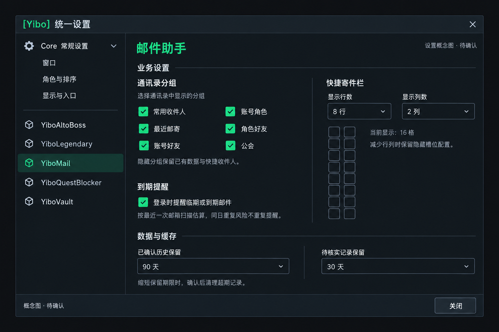

# YiboMail 设置页

日期：2026-10-06。内容与概念图：已确认；代码实施：已完成；游戏内视觉验收：待确认。

## 设置内容

Core 统一设置工作台承载业务设置、数据与缓存两个分区。业务设置为两栏：左栏为通讯录六组显示开关与登录提醒，右栏为快捷寄件栏行列与格数预览。空间不足时整组上下排列，由 Core 管理必要的纵向滚动。

- 通讯录：常用收件人、账号角色、最近邮寄、角色好友、账号好友、公会，默认全部显示。设置适用于通讯录来源菜单、全局搜索与服务器候选；快捷槽位选人也使用同一筛选。隐藏保留来源数据、好友采集与已配置快捷收件人；所有分组关闭时显示空候选。
- 快捷寄件栏：行数 1–12、列数 1–6，默认 8×2，最多 72 格。固定槽位序号按行排列，改变列数重新排布；缩小仅隐藏尾部槽位，扩大恢复配置。最多 8 行时保持原有尺寸，减少行数同时缩短面板；超过 8 行时按邮箱可用高度缩小槽位。设置页格子预览随行列缩小，保持在业务分区内。原常用联系人首次导入仍只导入最多 16 格。
- 登录到期提醒：默认开启，保留已有估算、风险去重与角色准入口径。
- 数据与缓存：已确认历史默认 90 天；待核实记录默认 30 天。沿用现有保留期限选项及缩短时确认、取消不变更的逻辑。

设置即时保存到 YiboMailDB.settings。分组使用 recipientGroups，行列使用 shortcutRows / shortcutColumns；旧数据缺少字段时使用默认值。通讯录右下角“设置”跳转 Core 邮件设置页。导航、壳、关闭操作与通用字段配置由 Core 管理。

## 验证

自动回归覆盖：设置控件重复创建、宽窄布局、格数预览、保留期限确认、隐藏分组后的来源菜单与全局搜索、数据仍可查询、缩小后快捷配置保留、扩大到 72 格、设置入口跳转，以及既有收发与公开 API。

客户端检查：

1. 打开 Core 邮件设置页，核对两栏及安全屏幕高度、文字和控件可读性。
2. 关闭各通讯录分组，验证菜单和全局搜索立即过滤；全部关闭后无候选，开启恢复。已配置快捷收件人仍可使用。
3. 预设第 16、72 格，切换 1×1、8×2、12×6，核对面板与预览一致、隐藏配置恢复；重载后设置保留。
4. 从通讯录“设置”进入同一工作台；关闭或切页后下拉菜单同时关闭。
5. 缩短两项保留期限分别取消、确认，核对数据；登录提醒开启与关闭沿用原风险提示。

2026-10-06 客户端反馈修正：行列上限扩至 12×6；Core 设置工作台使用当前页面实际内容高度判断滚动，并消除业务面板重复底部留白。真实工作台回归模拟旧控件导致原生滚动范围为 999，验证 600 高视口无滚动条、300 高视口正常滚动、恢复 600 高后滚动条隐藏且偏移归零。

## 快捷寄件栏拖动

状态：代码已完成，客户端交互验收待确认。

左键拖动已配置图标，图标跟随鼠标，源格暂时淡化；落到空格移动，落到已配置格交换地址与备注。拖到栏外清空该快捷格；拖到自身、源配置已变化，或关闭/收起/改变布局时保持原配置。拖动释放不填写收件人、不触发原生发送，不改变正文、主题、附件、金额或 COD。操作直接更新 quickRecipients 并刷新图标，常用联系人不受影响，重新登录后保留位置。

自动回归覆盖移动、交换、拖到自身与栏外、源配置变化、取消后恢复透明度、保留草稿、拖动释放禁止发送与普通左键发送仍可用。客户端需验证实际鼠标拖放、关闭发件箱、收起快捷栏、跨行跨列交换和重载后的保存。

## 游戏图标选择

状态：方案已确认、代码已完成，客户端验收待确认。

Core `UI/IconPicker.lua` 提供游戏图标网格与分页、当前预览、确认/取消和自动图标；通过客户端宏图标与物品宏图标接口枚举并去重，兼容可用的旧版枚举接口。列表首次打开时按需读取；没有可用枚举结果时提供明确提示并保留自动图标能力。没有名称数据的图标仅供浏览。

Mail 已配置快捷格的右键菜单提供“修改图标…”。`quickRecipients[slot].icon` 保存图标 FileID 或游戏图标路径；nil 为自动职业/通用图标。确认后保存，取消不变更；移动、对调保留完整记录，拖动预览复用同一图标。编辑期间收件人记录发生替换或移动时拒绝过期保存。修改收件人地址时保留该格的图标选择。

拖到栏外清空地址、备注与图标，保留常用联系人；这是用户本轮确认的拖动规则。收起、关闭或布局改变仍仅取消进行中的拖动。

新增 Core TOC 文件后须同步更新 Core 与 Mail，完整退出并重新进入客户端。客户端核对：右键选图、超过一页的图标、当前图标定位、取消、自动恢复、不同职业图标、跨格移动/对调、栏外清空、重新登录后保留选择、邮箱关闭时选择器关闭，以及选图期间草稿和附件保持。

拖动边界细化：以快捷栏面板的完整矩形范围判断删除；栏内格子间隙及面板边距保持原位，只有鼠标释放在面板外才清空源格。自动回归分别覆盖栏内无目标格和栏外无目标格。
