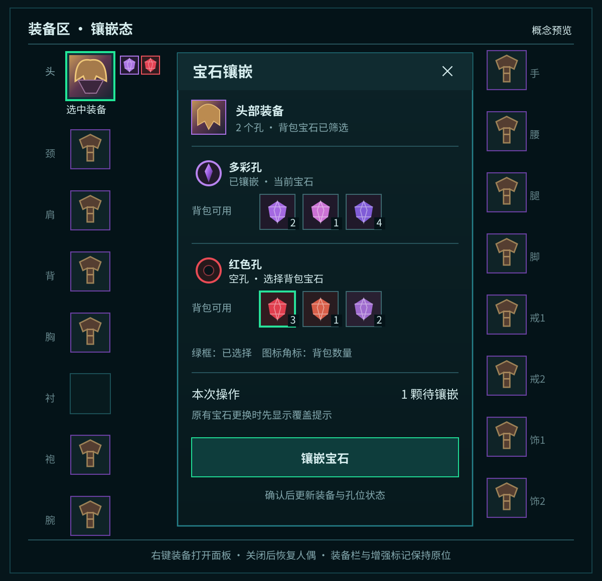

# YiboBuilds 装备交互与镶嵌面板历史草案

当前设计见 [YiboBuilds 装备提升面板设计方案](YiboBuilds-装备提升面板设计方案.md)。本文保留为此前概念的记录。

状态：待确认（设计概念，尚未实现）

## 目标与空间

- 装备图标保持现有位置，侧边两行增强标记继续显示孔位、附魔和工程状态。
- 右键一件已装备物品时，隐藏中央人偶，在其原区域显示该装备的镶嵌面板；关闭面板后恢复人偶。角色列表、左右装备列、天赋区和底部操作保持原位。
- 面板只操作当前角色的实物装备。查看其他角色的构筑快照时可看状态，但不出现可执行的镶嵌按钮。

## 交互

1. **装备与附魔。** 鼠标从背包拖起附魔卷轴，悬停兼容装备时仅高亮可放置装备；释放后交给游戏提供的物品使用与目标选择流程。若装备已有附魔，先显示替换后果。无效目标不高亮，原有装备 tooltip 仍可查看。
2. **进入镶嵌。** 右键装备图标打开中央面板并选中该装备。装备更换、角色切换或面板关闭时清除待选宝石。无孔装备显示“此装备没有可镶嵌的孔位”，不伪造空孔。
3. **逐孔选择。** 按实际孔序逐行显示孔型、已镶宝石或空心底座，以及从当前角色背包筛出的可用宝石。数量角标按背包实际堆叠数汇总；同名不同物品保留各自 tooltip。点击候选只做待安装预览，不立即消耗宝石。
4. **确认。** 底部集中确认本次选择。覆盖已有宝石时明确提示旧宝石会被替换；操作后重新扫描实际装备链接和孔序，再刷新装备图标、面板和账号快照。客户端拒绝、物品移动或背包状态变化时保留清楚的失败原因并重新筛选候选。

## 候选与状态规则

- 候选必须同时满足该孔的客户端兼容规则、物品可用状态和当前背包存在性。普通彩色孔、多彩孔、棱彩孔、染煞孔按实际游戏规则分别过滤；不把颜色相近当作可镶条件。
- 空孔继续使用既有空心底座；已镶孔显示实际宝石。孔型和来源沿用 `Docs/YiboBuilds-装备增强状态规则.md` 中的快照字段，不从图标颜色反推。
- 同一颗背包宝石被预选到多个孔时，待选数量不得超过实际持有数。候选为空时显示“背包中没有符合此孔的宝石”，并保留该孔状态。
- 面板可按孔行在内部纵向滚动，以支持少见的多孔装备；滚动不改变外部装备区尺寸，也不遮盖装备栏。

## 待实施前核对

实际执行路径需以当前 MoP Classic 客户端的镶嵌及物品使用 API 验证：自定义面板是否能直接提交镶嵌、是否必须借助游戏原生镶嵌框，以及受保护操作在战斗中如何处理。概念图只确定玩家看到的界面与交互顺序，不代表这些 API 已验证。

概念图中装备图标和宝石为示意图形；正式界面使用客户端真实物品图标与 tooltip。
