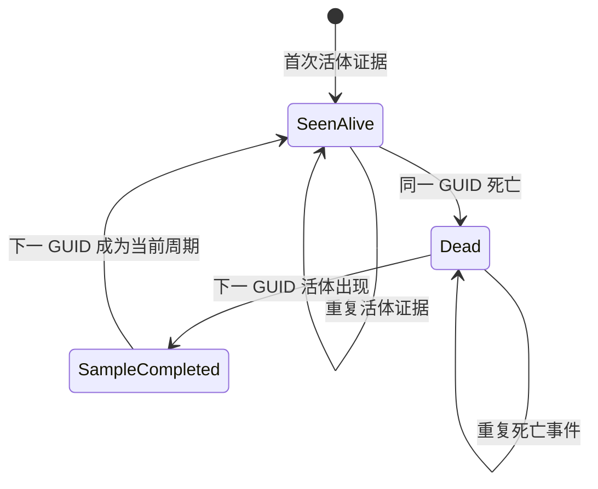

# YiboAltoBoss 刷新取样与计时 v3 设计

状态：已实施，待游戏内完整周期验收  
范围：刷新生命周期、样本、角色击杀、预测模型及账号视图展示  
说明：本文中的 v3 是取样数据结构版本，不等同于插件发布版本。

实现文件：

- `TrackingV3.lua`：生命周期 Reducer、样本去重、兼容读取、诊断与自测；
- `Core.lua`：Unit/Combat Log 事件适配、角色周常隔离和公共预测接口；
- `AccountPage.lua`：行动、位面、待完成周期和公共样本展示；
- `Commands.lua`：`debug`、`trace` 和 `selftest` 诊断入口。

## 1. 背景

现有实现把以下状态集中存放在 `phaseState`：

- 最近位面观测；
- 当前 Boss 的死亡时间；
- 等待下一次刷新的计时；
- 最近完成的刷新样本；
- 用于角色周常击杀的战斗事件。

这种耦合会导致事件顺序影响结果：新观测可能覆盖旧状态，无效观测可能清掉待完成计时，周常锁定与世界死亡互相触发，最终出现“角色已击杀但没有计时”或“连续击杀但样本不增加”。

v3 不再修补 `phaseState.lastKilledAt` 流程，而是以每一个 spawn GUID 为独立生命周期，重新建立事件驱动状态机。

## 2. 目标

v3 必须满足以下目标：

1. 正确记录角色本周是否已完成 Boss 击杀。
2. 正确记录客户端实际见证的 Boss 活体与死亡。
3. 正确把一次死亡与同服务器、同位面的下一次刷新连接成一个样本。
4. 同一个 Boss 的刷新规律跨服务器、跨位面共用。
5. 各服务器、各位面的现场死亡时间和预计刷新时刻保持独立。
6. 所有事件均幂等；重复目标、重复战斗日志或重复死亡事件不得产生重复样本。
7. 无法确认的事件只记录诊断信息，不得猜测、覆盖或清除有效状态。
8. UI 能分别说明角色击杀、当前计时、待完成周期、已完成样本和预测模型。

## 3. 正确性边界

插件只能保证客户端实际见证的生命周期：

```text
活体证据 → 同一 spawn GUID 的死亡证据 → 下一 spawn GUID 的活体证据
```

当客户端离线、插件未加载或完全错过某次死亡/刷新时，插件不能恢复精确样本。此时必须标记“周期不完整”或“缺少证据”，不得根据观察时间构造刷新时间。

“正确”具体表示：

- 不把尸体当作活体或角色击杀；
- 不把两个服务器或两个位面的现场计时混在一起；
- 不把重复事件计为多次死亡或多条样本；
- 不用客户端发现 Boss 的时间冒充 Boss 实际出生时间；
- 不在证据不足时生成看似精确的预测。

## 4. 四类数据必须独立

| 数据域 | 作用域 | 数据来源 | 禁止影响 |
| --- | --- | --- | --- |
| 角色击杀 | 角色 + Boss + 重置周期 | 周常锁定、目标策略、手动补记 | 不得启动刷新计时 |
| Spawn 生命周期 | 服务器 + Boss + 位面 + spawn | 活体证据、死亡证据 | 不得直接标记角色周常 |
| 刷新样本 | Boss，共享 | 相邻生命周期的死亡与出生 | 不得保存当前现场计时 |
| 预测模型 | Boss，共享 | 可参与预测的完整样本 | 不得修改任何原始记录 |

核心约束：

- `UNIT_DIED` 永不直接修改角色击杀。
- 周常锁定永不创建刷新样本或世界死亡计时。
- 手动补记永不创建世界死亡计时。
- 位面观测永不直接修改角色击杀。
- 预测函数必须是原始样本的只读计算。

## 5. 生命周期状态机

每个 spawn GUID 单独保存一条生命周期记录。



状态含义：

- `SeenAlive`：已确认该 spawn 存活，允许接受其死亡事件。
- `Dead`：已确认该 spawn 死亡，等待下一 spawn 出现。
- `SampleCompleted`：已生成从本次死亡到下一次出生的候选样本。
- `Incomplete`：缺少 GUID、出生时间、死亡证据或位面标识，只用于诊断。

状态转换必须由统一 reducer 完成。UI、战斗日志处理器和任务同步不得直接改写生命周期表。

## 6. 身份与键

一个生命周期的完整身份为：

```text
realmKey / bossKey / phaseKey / spawnSignature
```

字段说明：

- `realmKey`：标准化服务器名；
- `bossKey`：稳定业务键，例如 `ordos`；
- `phaseKey`：从 Creature GUID 提取并标准化的位面键；
- `spawnSignature`：从 Creature GUID 的 spawn UID 提取的稳定出生签名；
- `spawnGUID`：保留完整 GUID，用于精确关联战斗日志和诊断。

如果 `phaseKey` 或 `spawnSignature` 无法可靠解析，可以记录现场观测和死亡，但不得生成可参与预测的样本。

## 7. 时间基准

所有持久化的时间统一使用：

```lua
GetServerTime()
```

仅在 API 不可用时才回退到 `time()`。

以下字段必须使用同一时间轴：

- `spawnedAt`；
- `firstSeenAt`；
- `lastSeenAt`；
- `diedAt`；
- `sample.completedAt`；
- 角色击杀的 `updatedAt`。

Combat Log 自带的相对时间戳不得直接与 GUID 出生时间相减。

GUID 出生时间解析必须先通过诊断输出验证。解析失败或出现未来时间时，保留原始 GUID 和错误原因，不得用 `observedAt` 替代 `spawnedAt`。

## 8. 活体证据

以下事件可以确认一个 spawn 存活：

### 8.1 Unit 证据

- `target`；
- `focus`；
- `mouseover`；
- `boss1` 到 `boss4`；
- `UnitExists(unit)` 为真；
- `UnitIsDeadOrGhost(unit)` 为假；
- GUID 能解析为已启用的目标。

### 8.2 战斗证据

当已启用目标作为 Combat Log 的来源或目标时，以下事件可确认其存活：

- 伤害；
- 未命中；
- 施法开始、成功或失败；
- 光环应用或刷新。

以下事件不能作为活体证据：

- `UNIT_DIED`；
- 光环移除；
- 单纯看到尸体；
- 没有目标 GUID 的系统消息。

重复活体证据只更新 `lastSeenAt` 和证据来源，不得创建新生命周期或新样本。

## 9. 死亡证据

### 9.1 `UNIT_DIED`

只有该精确 GUID 已经存在活体证据时才接受。

如果没有活体证据：

- 不标记角色击杀；
- 不创建死亡计时；
- 记录诊断原因 `death_without_alive_evidence`；
- 不修改其它生命周期。

### 9.2 `PARTY_KILL`

`PARTY_KILL` 可以作为强死亡证据，即使活体证据刚好未保存，也可以根据目标 GUID 创建并关闭生命周期。

它仍然不能直接作为标准世界 Boss 的角色周常最终状态，只能触发一次周常锁定复查。

### 9.3 幂等规则

- 同一 GUID 只允许一个 `diedAt`；
- 后续重复死亡事件只能补充证据来源；
- 不得用较晚事件覆盖第一次确认的死亡时间；
- 死亡事件不得清除此前未完成的其它生命周期。

## 10. 样本生成

一条刷新样本表示：

```text
同服务器、同 Boss、同位面的上一 spawn 死亡
    → 下一不同 spawn 的实际出生
```

样本不是一次击杀。击杀只产生一个等待完成的死亡周期；下一 spawn 出现时才完成样本。

### 10.1 生成条件

必须同时满足：

1. `realmKey` 相同；
2. `bossKey` 相同；
3. `phaseKey` 相同且不是未知；
4. 前后 `spawnSignature` 不同；
5. 上一生命周期已有 `diedAt`；
6. 下一生命周期已有可信 `spawnedAt`；
7. `next.spawnedAt > previous.diedAt`；
8. 样本唯一键尚未存在。

### 10.2 唯一样本键

```text
realmKey / bossKey / phaseKey / previousSpawnSignature / nextSpawnSignature
```

该键保证重复目标、重复伤害、重复登录和重复刷新 UI 都不会追加重复样本。

### 10.3 乱序处理

每次生命周期发生变化后，都运行一次 `TryFinalizeAdjacentCycles`：

1. 按 `spawnedAt` 排序同一服务器、Boss、位面的生命周期；
2. 查找相邻的 `Dead → SeenAlive`；
3. 满足条件则生成样本；
4. 已存在 `sampleID` 时跳过。

因此即使事件晚到，后续状态更新仍可补齐样本。

### 10.4 无效转换

以下情况不得清除待完成死亡周期：

- 出生时间解析失败；
- `spawnedAt <= diedAt`；
- 位面未知；
- 收到旧 GUID 的迟到事件；
- 重复观测相同 spawn；
- 预测模型暂时不可用。

无效转换只写入诊断环形缓冲区。

## 11. 建议的数据结构

```lua
YiboAltoBossDB.trackingV3 = {
    schemaVersion = 3,
    realms = {
        [realmKey] = {
            bosses = {
                [bossKey] = {
                    phases = {
                        [phaseKey] = {
                            currentSpawnSignature = "...",
                            cycles = {
                                [spawnSignature] = {
                                    spawnGUID = "Creature-...",
                                    spawnSignature = "...",
                                    spawnedAt = 0,
                                    firstSeenAt = 0,
                                    lastSeenAt = 0,
                                    diedAt = nil,
                                    state = "SeenAlive",
                                    aliveEvidence = {},
                                    deathEvidence = {},
                                    sampleID = nil,
                                },
                            },
                        },
                    },
                },
            },
        },
    },
    samples = {
        [sampleID] = {
            bossKey = "ordos",
            realmKey = "...",
            phaseKey = "...",
            previousSpawnSignature = "...",
            nextSpawnSignature = "...",
            diedAt = 0,
            respawnedAt = 0,
            elapsedSeconds = 0,
            completedAt = 0,
            status = "complete",
            modelEligible = true,
            exclusionReason = nil,
            provenance = "v3",
        },
    },
    diagnostics = {},
}
```

角色周常继续保存在角色数据域，但写入入口必须与 `trackingV3` 完全分离。

## 12. 角色击杀策略

每个目标显式声明完成策略：

```text
weekly_lockout   标准世界 Boss，以服务器周常锁定为准
combat_personal  非周常目标，以明确的个人/队伍击杀证据为准
manual           只允许用户手动记录
```

标准世界 Boss：

- `C_QuestLog.IsQuestFlaggedCompleted` 是角色完成状态的最终依据；
- `PARTY_KILL` 只触发延迟复查；
- `UNIT_DIED` 只处理世界生命周期；
- 手动补记明确保存 `source = manual_recovery`；
- 周重置只清理角色完成状态，不清理生命周期或历史样本。

四天神继续使用共享周常锁定，并设置 `respawnTracking = false`，不创建行动、位面或样本。

## 13. 公共预测模型

同一个 `bossKey` 的刷新规律跨所有服务器、所有位面共用。预测函数不得再按服务器过滤样本。

模型输入只包含：

- `status = complete`；
- 结构完整；
- 时间合法；
- 未重复；
- `modelEligible = true`。

模型输出至少包括：

- 捕获记录总数；
- 参与预测数量；
- 排除数量及原因；
- 实测最小值、最大值、中位数；
- 预计刷新窗口；
- 模型置信等级；
- 样本涉及的服务器数量；
- 最新完整样本。

异常记录必须保留，不得从历史中删除。疑似跨过一次或多次刷新周期的长间隔可以标记为 `missed_cycle_candidate`，不参与主预测。

预测模型建议使用中位数与 MAD 做稳健聚类：

- 样本不足时明确显示“收集中”或“初步参考”；
- 不因为样本少而声称固定刷新；
- 不使用简单平均值让长间隔拉偏预测；
- 模型变化不得回写原始样本。

## 14. 行动、位面和角色列的职责

### 14.1 行动列

显示当前范围内最需要处理的现场周期：

- 当前服务器与位面；
- 死亡计时起点；
- 距预计刷新窗口的时间；
- 公共刷新模型；
- 已完成样本数；
- 待完成周期数。

行动状态来自生命周期和公共模型，不来自角色周常击杀。

### 14.2 位面列

只显示现场信息：

- 服务器；
- 位面；
- 当前 spawn；
- 最近活体观测；
- 最近死亡；
- 证据来源。

位面列不再重复公共样本统计。

### 14.3 角色列

只显示角色完成状态：

- 已击杀；
- 未击杀；
- 手动补记来源；
- 实际击杀的四天神成员等角色信息。

角色列不得读取世界死亡周期判断周常完成。

## 15. UI 数量语义

UI 必须避免使用含糊的 `2 / 3`。建议固定使用：

```text
已完成样本  3
待完成周期  1（等待下一次刷新）
参与预测    2
排除异常    1
```

数量变化时机：

- Boss 死亡：`待完成周期 +1`；
- 下一 spawn 出现：`待完成周期 -1`、`已完成样本 +1`；
- 重复事件：所有数量不变；
- 周常锁定更新：只改变角色列。

## 16. 数据迁移

迁移必须非破坏性执行。

### 16.1 保留

- 当前角色目录；
- 当前周常击杀记录；
- 当前设置；
- 现有 `respawnSamples`。

### 16.2 v2 历史样本

现有样本迁移为：

```text
provenance = v2_legacy
status = complete
modelEligible = 经过结构校验后的结果
```

v2 样本保留原始服务器、位面、死亡时间、出生时间和间隔。迁移不得修改原始数组，直到 v3 完成验证和用户确认。

### 16.3 不迁移为活动计时

现有 `worldState.lastKilledAt` 含义不稳定，不得直接迁移成 v3 待完成周期。v3 活动周期从升级后首次可信活体或死亡证据开始。

### 16.4 模型优先级

- 有足够 v3 样本时，模型优先使用 v3；
- v3 样本不足时，可以使用通过校验的 v2 历史样本作为参考；
- Tooltip 必须标明“v3 实测”与“v2 历史参考”的数量。

## 17. 清理与保留

- 活动或待完成生命周期不得使用通用 6 小时 TTL 直接删除。
- 清理前必须先尝试完成相邻生命周期。
- 已完成周期可以只保留最近若干条详细记录，完整样本长期保留。
- 超期未完成周期标记为 `expired_incomplete`，从行动列隐藏，但保留诊断原因。
- 清理规则不得影响角色周常和公共预测历史。

## 18. 诊断设计

`/yab debug` 需要扩展为状态机诊断，而不是只打印 Boss 列表。

建议支持：

```text
/yab debug ordos
/yab trace on
/yab trace off
/yab selftest
```

`debug` 至少输出：

- 当前服务器、Boss、位面；
- 当前 spawn GUID、签名和解析出生时间；
- 生命周期状态；
- 最近死亡时间；
- 待完成周期；
- 最近完成样本；
- 样本总数、参与数、排除数；
- 最近一次拒绝事件及原因。

`trace` 只记录状态转换，不记录每一条伤害事件，避免刷屏：

```text
NEW_SPAWN
ALIVE_CONFIRMED
DEATH_ACCEPTED
DEATH_REJECTED
SAMPLE_COMPLETED
SAMPLE_REJECTED
WEEKLY_LOCKOUT_CONFIRMED
```

## 19. Reducer 接口建议

所有外部事件先转换为统一业务事件：

```lua
Reducer:Apply({
    type = "ALIVE_EVIDENCE" or "DEATH_EVIDENCE",
    at = GetServerTime(),
    realmKey = realmKey,
    bossKey = bossKey,
    phaseKey = phaseKey,
    spawnGUID = guid,
    spawnSignature = signature,
    spawnedAt = spawnTime,
    source = source,
})
```

Reducer 负责：

1. 校验事件；
2. 幂等写入生命周期；
3. 尝试完成相邻周期；
4. 追加唯一样本；
5. 写入诊断转换；
6. 发出一次 UI 刷新通知。

事件处理器不得直接操作 SavedVariables 的内部字段。

## 20. 验收用例

### 20.1 尸体防误记

1. 插件加载后只看到 Boss 尸体。
2. 不产生角色击杀。
3. 不产生生命周期。
4. 不产生死亡计时。
5. 不产生样本。

### 20.2 完整刷新周期

1. 观察活体 A。
2. A 死亡。
3. 出现一个待完成周期。
4. `/reload` 后待完成周期仍存在。
5. 活体 B 首次出现或进入战斗。
6. 生成唯一的 A → B 样本。
7. 样本数量增加 1，待完成周期减少 1。

### 20.3 连续击杀

1. B 死亡后生成新的待完成周期。
2. 活体 C 出现时生成 B → C 样本。
3. 每个完整周期恰好增加一条样本。

### 20.4 重复事件

对同一 spawn 重复触发目标、鼠标、伤害、施法和死亡事件：

- 生命周期仍只有一条；
- `diedAt` 不变；
- 样本不重复；
- UI 数量不抖动。

### 20.5 跨服务器共用模型

1. 在服务器 A 完成样本。
2. 切换服务器 B。
3. 同一 Boss 的样本数和预测模型一致。
4. A、B 的死亡计时与预计刷新时刻彼此独立。

### 20.6 周常击杀隔离

1. `UNIT_DIED` 不改变角色列。
2. 周常锁定更新后角色列变为已击杀。
3. 周常更新不改变待完成周期或样本数。
4. 周重置不删除刷新样本。

### 20.7 不完整周期

1. 客户端离线期间错过死亡或刷新。
2. 插件不构造样本。
3. 诊断显示缺少的证据。
4. 预测模型不使用不完整周期。

### 20.8 事件乱序

模拟重复或迟到事件：

- Reducer 最终状态一致；
- 相邻生命周期完整后仍能补成样本；
- 无效事件不会清除活动周期。

## 21. 实施顺序

1. 冻结现有采样入口，不再继续修改 `lastKilledAt` 流程。
2. 新建纯状态机与 v3 数据结构。
3. 实现 GUID 解析诊断和统一服务器时间。
4. 接入 Unit 活体证据。
5. 接入 Combat Log 活体与死亡证据。
6. 实现相邻周期样本生成和去重。
7. 分离角色周常同步。
8. 实现公共预测模型。
9. 接入行动、位面和角色列。
10. 实现非破坏性 v2 迁移。
11. 运行 reducer 自测和游戏内验收清单。
12. 验证通过后再移除旧采样路径。

## 22. 完成标准

只有同时满足以下条件，v3 才算完成：

- 所有验收用例通过；
- 连续三个完整刷新周期均各自产生且只产生一条样本；
- 尸体测试连续执行不产生误记；
- `/reload` 不丢失待完成周期；
- 切服后公共模型一致、现场计时独立；
- 周常击杀与世界生命周期之间没有互相写入；
- 诊断能够解释每一次样本增加、拒绝或等待的原因；
- 旧数据未被破坏，回退仍然可行。
