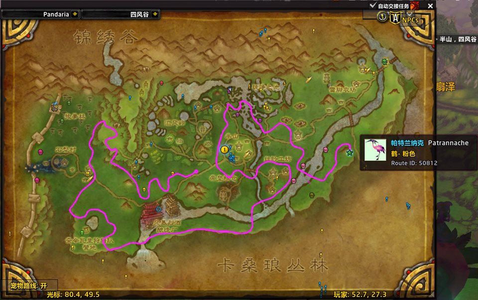

# YiboBeastPaths

潘达利亚隐藏猎人宠物路线图插件。  
作用是把部分稀有猎人宠物的巡逻/活动路线直接覆盖显示在世界地图上，方便在游戏内快速查看和蹲守。

当前版本：`v1.5`

## 界面预览

## 当前状态

- 已接入世界地图路线覆盖显示。
- 已接入小地图局部路线显示。
- 已提供地图左下角开关按钮，可直接切换路线显示。
- 已提供插件列表图标资源。
- 已为每条路线提供起点标记与悬浮信息。
- 已移除按钮切换时的聊天框刷屏提示。
- 仓库内包含 `_NonRelease/DebugCalibrator.lua` 调试校准工具，供路线微调用。

## 当前收录宠物

目前仓库内已收录 10 条潘达利亚隐藏猎人宠物路线：

- `50811` 重蹄 `Stompy`
- `50812` 帕特兰纳克 `Patrannache`
- `50813` 噩兆 `Portent`
- `50816` 刺脊 `Bristlespine`
- `50817` 血牙 `Bloodtooth`
- `50818` 赫克萨波斯 `Hexapos`
- `50820` 洛克海德 `Rockhide the Immovable`
- `50821` 萨维奇 `Savage`
- `50822` 微光之蛾 `Glimmer`
- `66522` 邦比 `Bombyx`

## 功能说明

- 在世界地图对应区域显示该地图下的宠物路线覆盖图。
- 在小地图范围内显示当前附近的局部路线线段。
- 路线起点会显示额外节点标记。
- 鼠标悬停节点时会显示宠物名称、英文名、外观标签、脚印名称和路线 ID。
- 地图左下角按钮可切换 `宠物路线: 开/关`。
- 支持命令：
  - `/ybp`
  - `/ybp show`
  - `/ybp hide`
  - `/ybp mmdebug`
  - `/ybpdebug`

## 安装方式

1. 将插件目录放入对应客户端：
   - Retail / 正式服：`World of Warcraft/_retail_/Interface/AddOns/`
   - MoP Classic：`World of Warcraft/_classic_/Interface/AddOns/`
2. 保证最终目录结构类似：
   `Interface/AddOns/YiboBeastPaths/`
3. 进入游戏后启用插件。

发布包包含多客户端 TOC：

- `YiboBeastPaths.toc`：Retail / 正式服默认入口
- `YiboBeastPaths_Mainline.toc`：Retail / 正式服
- `YiboBeastPaths_Mists.toc`：MoP Classic 专用入口，供支持 `_Mists` suffix 的客户端识别

## 主要文件

- [YiboBeastPaths.toc](E:/Program/YiboBeastPaths/YiboBeastPaths.toc)：插件入口与元数据
- [YiboBeastPaths_Mainline.toc](E:/Program/YiboBeastPaths/YiboBeastPaths_Mainline.toc)：Retail / 正式服入口与元数据
- [YiboBeastPaths_Mists.toc](E:/Program/YiboBeastPaths/YiboBeastPaths_Mists.toc)：MoP Classic 入口与元数据
- [Flavor.lua](E:/Program/YiboBeastPaths/Flavor.lua)：运行时客户端 flavor 识别
- [FlavorOverrides.lua](E:/Program/YiboBeastPaths/FlavorOverrides.lua)：Retail/Mists 数据覆盖入口
- [Core.lua](E:/Program/YiboBeastPaths/Core.lua)：初始化、按钮与命令
- [Renderer.lua](E:/Program/YiboBeastPaths/Renderer.lua)：世界地图路线绘制与节点显示
- [Data.lua](E:/Program/YiboBeastPaths/Data.lua)：宠物基础数据
- [RouteOverlays.lua](E:/Program/YiboBeastPaths/RouteOverlays.lua)：路线覆盖图资源映射
- [RouteNodes.lua](E:/Program/YiboBeastPaths/RouteNodes.lua)：路线节点与提示数据
- [RouteTransforms.lua](E:/Program/YiboBeastPaths/RouteTransforms.lua)：每条路线的定位参数
- [_NonRelease/DebugCalibrator.lua](E:/Program/YiboBeastPaths/_NonRelease/DebugCalibrator.lua)：路线调试校准面板

## v1.5 更新

- 发布结构调整为单包多客户端 TOC，同时承载 Retail / 正式服与 MoP Classic。
- 新增运行时 flavor 标记，暴露 `ns.FLAVOR`、`ns.IS_RETAIL`、`ns.IS_MISTS` 与 `ns.IS_CLASSIC`。
- 新增 `FlavorOverrides.lua`，后续 Retail/Mists 的地图、路线、节点、脚印或宠物数据差异可在覆盖层中维护。
- 当前 Retail 默认复用 MoP Classic 已校准的 Pandaria 共享基线数据。
- 已知限制：Retail 小地图与世界地图可能存在轻微差别，后续通过脚印采集和数据覆盖逐步细调。
- 已知限制：Retail 中锦绣谷可能受剧情阶段、旧新版地图或 Zidormi 相位影响，噩兆相关差异计划进入 `v1.5.1` 继续处理。

## v1.3 更新

- 补齐并接入 10 只潘达利亚隐藏猎人宠物的脚印名称数据。
- 起点节点 tooltip 新增脚印名称显示，并优化长文本宽度避免英文名换行。
- 持续整理世界地图/小地图调试数据与路线校准资料，便于后续继续修正。

## v1.2.1 更新

- 修复 `50813 / 噩兆 / 锦绣谷` 的一轮小地图路线校准。
- 重新接回并增强 `/ybpdebug` 调试面板，支持大地图与小地图分离调参。
- 为小地图新增独立的偏移、缩放、横纵缩放与线宽调试能力。
- 重排调试面板布局，并补充窗口位置持久化。

## v1.2 更新

- 小地图路线已补齐到全部 10 条潘达利亚隐藏猎人宠物。
- 新增小地图调试命令 `/ybp mmdebug`，用于快速查看当前地图命中与渲染状态。
- 新增 `_NonRelease/Tools/generate_curated_routes.py`，可从世界地图覆盖图自动反推小地图路线点数据。

## v1.1 更新

- 新增小地图局部路线显示。
- 小地图路线支持随玩家位置、小地图缩放与旋转实时更新。
- 小地图路线已接入与世界地图一致的路线校准参数。
- 调整小地图路线线宽、边界裁切与分段衔接，减少断点感。

## v1.0.1 更新

- 新增项目主 Logo 与插件列表小图标。
- 为插件列表接入 `IconTexture`。
- 调整世界地图开关按钮的大小、位置和状态文案。
- 修复按钮只显示外框、不显示文本的问题。
- 修复按钮相关兼容问题导致的路线不显示风险。
- 移除路线开关时的聊天框提示。

## 说明

- 当前路线效果依赖覆盖图资源与定位参数。
- 如果某条路线位置仍需微调，可使用 `/ybpdebug` 打开调试校准面板继续修正。
